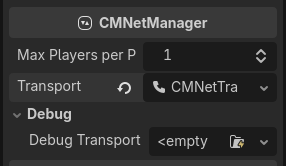
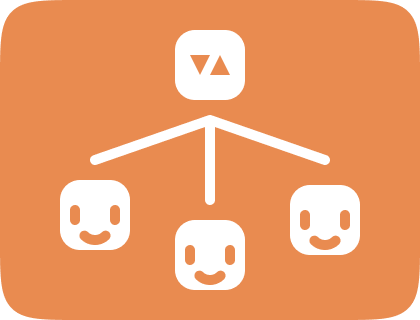
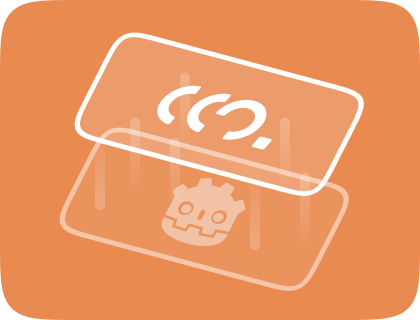

# CM.gd - Godot Multiplayer Framework▗

[Documentation]() ⁃ [Discord](https://discord.gg/Wy3bSMAV7v)

CM.gd is a multiplayer game framework that abstracts Godot's multiplayer layer as objects and lets you create single-player, Couch Co-op multiplayer, and networked multiplayer from a single Godot Project. Inspired by Photon and Mirror Networking.

## ▛ Features

### ▚ Flexible Player Joining Mechanism

This framework's player management allows for flexible player joining mechanisms. Want to join from controllers? Sure. Want to join over the network? Sure. Or mix and match them together in the same game, you can do that! (Think of Plate Up! or Overcooked's Multiplayer. If you have ever played it)

---

### ▞ Multiplayer Organized into Nodes

This framework's node and objects are designed in an object-oriented manner. You can create a `CMSession` and configure it's player and network management features right away in the editor.

---

### ▜ Automatic Player/Peer Management

From The network connection process, peer/player replications, to cleanup; are done automatically by the framework.

---

### ▟ Built on top of Godot's Multiplayer APIs

The framework's networking is based on Godot's Multiplayer APIs. Which means you can use the standard multiplayer APIs, multiplayer peers extensions, and other multiplayer addons with it (eg. netfox, Tube, GodotSteam, etc.).

Also checkout [netfox](https://store.godotengine.org/asset/foxssake/netfox/)! I'm sure this framework goes well with the netfox addon.

> ⚠️ Due to the framework being in it's early stages. The architecture design of this framework might change, so **I don't recommend you using this in big projects yet**. Though, you can try it out in your experimental projects!!

## Getting started with the framework

Please refer to the getting started guide to get started!

## Help!! I'm lost

- You can join the [Discord](https://discord.gg/Wy3bSMAV7v) server if you need any help/questions using the framework!!

## Liking this framework?

Consider supporting me on [Ko-fi](https://ko-fi.com/kunmawji)!

